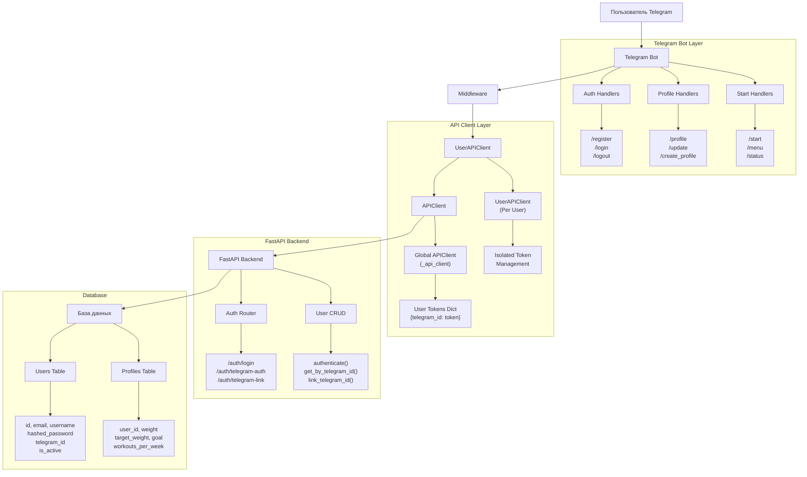

# 🔐 Система авторизации FitMind Coach

Полное описание архитектуры и функционирования системы авторизации в приложении FitMind Coach - Telegram бот с FastAPI backend.

## 📋 Содержание

- [Архитектура системы](#архитектура-системы)
- [Компоненты системы](#компоненты-системы)
- [Типы авторизации](#типы-авторизации)
- [Безопасность и изоляция](#безопасность-и-изоляция)
- [База данных](#база-данных)
- [API Endpoints](#api-endpoints)
- [Команды бота](#команды-бота)
- [Процесс авторизации](#процесс-авторизации)
- [Примеры использования](#примеры-использования)
- [Диагностика и отладка](#диагностика-и-отладка)

## 🏗️ Архитектура системы

Система авторизации построена по трехуровневой архитектуре:



### 🔄 Уровни системы

1. **Telegram Bot слой** - Обработка команд пользователей, FSM состояния, middleware
2. **API Client слой** - Управление HTTP запросами, токенами, изоляция пользователей
3. **FastAPI Backend** - JWT авторизация, бизнес-логика, работа с БД

## 🧩 Компоненты системы

### Telegram Bot Components

| Компонент | Файл | Описание |
|-----------|------|----------|
| Auth Handlers | `bot/handlers/auth.py` | Обработчики `/register`, `/login`, `/logout` |
| Start Handlers | `bot/handlers/start.py` | Обработчики `/start`, `/menu`, `/status` |
| Profile Handlers | `bot/handlers/profile.py` | Обработчики `/profile`, `/update`, `/create_profile` |
| Middleware | `bot/main.py` | Автоматическая проверка авторизации |

### API Client Components

| Компонент | Файл | Описание |
|-----------|------|----------|
| APIClient | `bot/api_client.py` | Глобальный HTTP клиент с управлением токенами |
| UserAPIClient | `bot/api_client.py` | Изолированный клиент для каждого пользователя |

### Backend Components

| Компонент | Файл | Описание |
|-----------|------|----------|
| Auth Router | `api/routers/auth.py` | Эндпоинты авторизации |
| User CRUD | `api/crud/user.py` | Операции с пользователями в БД |
| User Model | `api/models/user.py` | Модели User и Profile |
| Security | `api/core/security.py` | JWT токены, хеширование паролей |

## 🔑 Типы авторизации

### 1. Регистрация новых пользователей

**Команда:** `/register`

**Процесс:**
```
1. Email ввод → валидация формата
2. Username ввод → проверка длины (≥3 символов)
3. Password ввод → проверка длины (≥8 символов)
4. Подтверждение пароля → сверка с предыдущим
5. API запрос регистрации → создание пользователя в БД
6. Автоматический логин → получение JWT токена
7. Сохранение токена → готовность к созданию профиля
```

**Пример обработчика:**
```python
@router.message(RegisterForm.password_confirm)
async def process_password_confirm(message: Message, state: FSMContext):
    # Получение данных из FSM
    data = await state.get_data()
    telegram_id = message.from_user.id

    # Создание API клиента для пользователя
    user_api = get_user_api_client(telegram_id)

    # Регистрация через API
    result = await user_api.client.register(
        data["email"], data["username"], data["password"]
    )

    if result:
        # Автоматический логин после регистрации
        login_result = await user_api.login(data["email"], data["password"])
```

### 2. Логин существующих пользователей

**Команда:** `/login`

**Процесс:**
```
1. Email/Username ввод → определение типа (email содержит @)
2. Password ввод → аутентификация
3. Попытка привязки Telegram ID → связывание аккаунтов
4. Если привязка успешна → автоматическая Telegram авторизация
5. Если не удалось → стандартная авторизация по логину/паролю
```

**Пример логики привязки:**
```python
# Попытка привязать Telegram ID к аккаунту
link_result = await user_api.client.link_telegram(
    data["username"], data["password"], telegram_id
)

if link_result:
    # Привязка успешна - авторизация по Telegram ID
    auth_result = await user_api.telegram_auth()
else:
    # Обычная авторизация
    result = await user_api.login(data["username"], data["password"])
```

### 3. Автоматическая авторизация по Telegram ID

**Команды:** `/start`, `/menu`, любая команда

**Процесс:**
```
1. Middleware перехватывает сообщение
2. Создание UserAPIClient(telegram_id)
3. Попытка telegram_auth() → поиск пользователя в БД
4. Если найден → выдача JWT токена
5. Если не найден → предложение регистрации/логина
```

**Middleware код:**
```python
async def auth_middleware(handler, event, data):
    if isinstance(event, Message) and event.from_user:
        # Персональный API клиент для каждого пользователя
        user_api_client = UserAPIClient(event.from_user.id)
        data["api_client"] = user_api_client

        # Автоматическая попытка авторизации
        if not _api_client.get_token(user_api_client.telegram_id):
            auth_success = await user_api_client.telegram_auth()
```

## 🛡️ Безопасность и изоляция

### Изоляция пользователей

**Проблема (решена):** Раньше был глобальный API клиент, токены разных пользователей перезаписывали друг друга.

**Решение:** Каждый пользователь получает изолированный `UserAPIClient`:

```python
class APIClient:
    def __init__(self):
        # Словарь токенов по Telegram ID
        self.user_tokens: Dict[int, str] = {}

    def get_token(self, telegram_id: int) -> Optional[str]:
        return self.user_tokens.get(telegram_id)

    def set_token(self, telegram_id: int, token: str) -> None:
        self.user_tokens[telegram_id] = token

class UserAPIClient:
    def __init__(self, telegram_id: int):
        self.telegram_id = telegram_id
        self.client = _api_client  # Общий клиент для HTTP

    async def get_profile(self):
        # Токен автоматически берется для этого пользователя
        return await self.client.get_profile(self.telegram_id)
```

### JWT Токены

**Backend безопасность:**
```python
# Создание токена
access_token = create_access_token(user_obj.id)
refresh_token = create_refresh_token(user_obj.id)

# Проверка токена в запросах
@app.middleware("http")
async def auth_middleware(request: Request, call_next):
    token = request.headers.get("Authorization")
    if token:
        user = verify_jwt_token(token)
        request.state.user = user
```

### Хеширование паролей

```python
# При регистрации
hashed_password = get_password_hash(password)

# При проверке
def authenticate(email: str, password: str):
    user = get_user_by_email(email)
    if user and verify_password(password, user.hashed_password):
        return user
```

## 💾 База данных

### Таблица Users

```sql
CREATE TABLE users (
    id SERIAL PRIMARY KEY,
    email VARCHAR(255) UNIQUE NOT NULL,
    username VARCHAR(50) UNIQUE NOT NULL,
    hashed_password VARCHAR(255) NOT NULL,
    telegram_id BIGINT UNIQUE,  -- Ключ привязки к Telegram
    is_active BOOLEAN DEFAULT TRUE,
    is_superuser BOOLEAN DEFAULT FALSE,
    created_at TIMESTAMP DEFAULT NOW(),
    updated_at TIMESTAMP
);
```

### Таблица Profiles

```sql
CREATE TABLE profiles (
    id SERIAL PRIMARY KEY,
    user_id INTEGER REFERENCES users(id) ON DELETE CASCADE,
    full_name VARCHAR(100),
    age INTEGER,
    weight FLOAT,
    height FLOAT,
    goal VARCHAR(50) DEFAULT 'other',
    target_weight FLOAT,
    workouts_per_week FLOAT,
    avg_calories INTEGER,
    created_at TIMESTAMP DEFAULT NOW(),
    updated_at TIMESTAMP
);
```

### Связи в БД

```python
# User модель
class User(Base):
    profile: Mapped["Profile"] = relationship(
        back_populates="user", uselist=False, cascade="all, delete-orphan"
    )
    workouts: Mapped[List["Workout"]] = relationship(
        back_populates="user", cascade="all, delete-orphan"
    )
```

## 🌐 API Endpoints

### Авторизация

| Метод | Endpoint | Описание | Тело запроса |
|-------|----------|----------|--------------|
| POST | `/auth/login` | Логин по email/password | `{username, password}` |
| POST | `/auth/telegram-auth` | Авторизация по Telegram ID | `{telegram_id}` |
| POST | `/auth/telegram-link` | Привязка Telegram к аккаунту | `{email, password, telegram_id}` |

### Пользователи

| Метод | Endpoint | Описание | Авторизация |
|-------|----------|----------|-------------|
| POST | `/users` | Регистрация | Нет |
| GET | `/users/me` | Текущий пользователь | Bearer Token |
| GET | `/users/me/profile` | Профиль пользователя | Bearer Token |
| POST | `/users/me/profile` | Создание профиля | Bearer Token |
| PUT | `/users/me/profile` | Обновление профиля | Bearer Token |

### Примеры запросов

**Регистрация:**
```bash
curl -X POST "http://localhost:8000/users" \
  -H "Content-Type: application/json" \
  -d '{
    "email": "user@example.com",
    "username": "testuser",
    "password": "securepassword123",
    "is_active": true,
    "is_superuser": false
  }'
```

**Авторизация по Telegram:**
```bash
curl -X POST "http://localhost:8000/auth/telegram-auth" \
  -H "Content-Type: application/json" \
  -d '{"telegram_id": 1936422121}'
```

## 🤖 Команды бота

### Команды авторизации

| Команда | Описание | FSM State | Результат |
|---------|----------|-----------|-----------|
| `/register` | Пошаговая регистрация | RegisterForm | Новый аккаунт + автологин |
| `/login` | Логин + привязка Telegram | AuthForm | Авторизация + привязка |
| `/logout` | Выход из системы | - | Очистка токена |
| `/status` | Проверка статуса | - | Информация об авторизации |

### Команды профиля

| Команда | Описание | Требует авторизации | Результат |
|---------|----------|-------------------|-----------|
| `/create_profile` | Создание профиля | Да | Пошаговое создание |
| `/profile` | Управление профилем | Да | Меню профиля |
| `/update` | Редактирование | Да | Форма редактирования |

### Команды навигации

| Команда | Описание | Логика |
|---------|----------|--------|
| `/start` | Главная команда | Автоавторизация → Меню или регистрация |
| `/menu` | Главное меню | Проверка профиля → Меню или создание |
| `/help` | Справка | Список всех команд |

## 🔄 Процесс авторизации при старте

### Сценарий 1: Новый пользователь

```
/start → Нет Telegram ID в БД → Предложение регистрации

"👋 Привет! Я FitMind Coach - твой ИИ-помощник для спорта и питания.

Для начала работы тебе нужно зарегистрироваться в системе:
▫️ Используй команду /register для регистрации
▫️ Если у тебя уже есть аккаунт, используй /login"
```

### Сценарий 2: Пользователь с привязанным Telegram

```
/start → Есть Telegram ID → Автоавторизация → Проверка профиля

Если профиль есть: Главное меню
Если профиля нет: "Ты уже авторизован! Создай профиль с помощью /create_profile"
```

### Сценарий 3: Авторизованный пользователь без привязки

```
/start → Есть токен, но нет Telegram ID → Профиль доступен

Обычное использование, но при перезапуске бота потребуется повторная авторизация
```

## 💡 Примеры использования

### Полный цикл нового пользователя

```python
# 1. Пользователь отправляет /start
user_id = 1936455555
await cmd_start(message)  # Предложение регистрации

# 2. Регистрация
await cmd_register(message, state)      # /register
await process_email(message, state)     # Ввод email
await process_reg_username(message, state)  # Ввод username
await process_reg_password(message, state)  # Ввод password
await process_password_confirm(message, state)  # Подтверждение

# 3. Создание профиля
await cmd_create_profile(message, state)  # /create_profile
await process_goal(message, state)        # Выбор цели
await process_weight(message, state)      # Ввод веса
await process_target_weight(message, state)  # Целевой вес
await process_level(message, state)       # Уровень подготовки

# 4. Готовность к использованию
await cmd_start(message)  # Главное меню
```

### Существующий пользователь привязывает Telegram

```python
# У пользователя есть аккаунт alex@example.com / pass123
# Telegram ID: 1936455555

# 1. Логин с привязкой
await cmd_login(message, state)
await process_username(message, state)  # "alex@example.com"
await process_password(message, state)  # "pass123"

# 2. Backend привязывает Telegram ID
await user_api.client.link_telegram(
    "alex@example.com", "pass123", 1936455555
)

# 3. Дальше автоматическая авторизация при /start
await cmd_start(message)  # Автологин по Telegram ID
```

## 🔍 Диагностика и отладка

### Команда /status

Показывает полную информацию о состоянии авторизации:

```python
async def cmd_status(message: Message):
    telegram_id = message.from_user.id

    # Проверки
    has_token = bool(_api_client.get_token(telegram_id))
    profile = await user_api.get_profile()
    has_profile = bool(profile)

    status_text = f"""
🔍 *Статус авторизации:*

📱 Telegram ID: {telegram_id}
{'✅' if has_token else '❌'} Авторизован: {'Да' if has_token else 'Нет'}
{'✅' if has_profile else '❌'} Профиль: {'Создан' if has_profile else 'Не создан'}
    """
```

### Логирование

```python
# В bot/logger.py настроено логирование всех авторизаций
logger.info(f"Токен установлен для пользователя {telegram_id}")
logger.info(f"Успешная авторизация пользователя по Telegram ID {telegram_id}")
logger.error(f"Ошибка авторизации: {e}")
```

### Типичные проблемы и решения

| Проблема | Симптомы | Решение |
|----------|----------|---------|
| Пользователи видят чужие данные | Неправильные профили в /profile | Проверить UserAPIClient изоляцию |
| Токен не сохраняется | Повторные запросы авторизации | Проверить _api_client.set_token() |
| Ошибки в handlers | TypeError о telegram_id | Обновить сигнатуры методов API |
| Неработающие команды | Нет ответа на команды | Проверить регистрацию роутеров |

## 📝 Заключение

Система авторизации FitMind Coach обеспечивает:

✅ **Безопасность** - JWT токены, хеширование паролей, изоляция пользователей
✅ **Удобство** - автоматическая авторизация по Telegram ID
✅ **Гибкость** - поддержка регистрации и привязки существующих аккаунтов
✅ **Надежность** - проверка состояний, обработка ошибок, логирование
✅ **Масштабируемость** - изолированные API клиенты для каждого пользователя

Архитектура позволяет легко добавлять новые методы авторизации и расширять функциональность без нарушения безопасности существующих пользователей.
